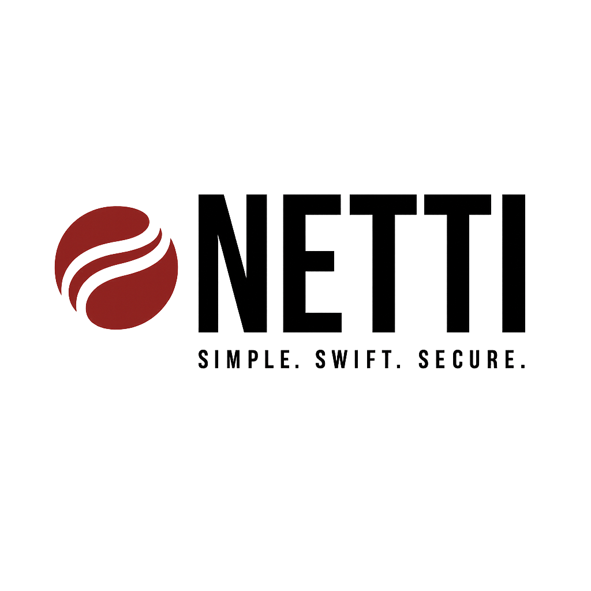

<div align="center">
<picture>
  <source media="(prefers-color-scheme: dark)" srcset="./Assets/netti-dark.png" width="350">
  
</picture>
</div>

[](https://img.shields.io/badge/Swift-5.9_5.10_6.0-Orange?style=flat-square)
[](https://img.shields.io/badge/Platforms-macOS_iOS_tvOS_watchOS_vision_OS_Linux_Windows_Android-Green?style=flat-square)
[](https://img.shields.io/badge/Swift_Package_Manager-compatible-orange?style=flat-square)


Netti is a modular, type-safe Swift networking library built on top of Alamofire. It aims to streamline network operations with a consistent and protocol-oriented approach, utilizing modern Swift features like async/await and Swift concurrency.

## Features

- ✅ Protocol-oriented networking architecture
- ✅ Support for multiple HTTP methods (GET, POST, PUT, DELETE, etc.)
- ✅ Type-safe response parsing with `Decodable`
- ✅ Configurable headers, timeout, and encoding strategies
- ✅ Alamofire-powered request execution with SSL pinning support
- ✅ Built-in JSON encoding/decoding strategies (e.g., snake_case conversion)
- ✅ Network monitoring via `NWPathMonitor`
- ✅ Mock data support for testing

---

## Getting Started

### Requirements

- iOS 13.0+ / macOS 10.15+
- Swift 5.6+
- Alamofire

### Installation

Use Swift Package Manager:

```swift
// swift-tools-version:6.1

import PackageDescription

let package = Package(
    name: "YourPackageName",
    dependencies: [
        .package(url: "https://github.com/Stof83/Netti.git", from: "1.0.0")
    ],
    targets: [
        .target(
                name: "YourTargetName",
                dependencies: [
                    .product(name: "Netti", package: "Netti")
                ]
        )
    ]
)
```

---

## Usage

### Define API Endpoints

```swift

enum MyAPIs {
    case users
}

extension MyAPIs: HTTPRequest {
    var baseURL: URL? { URL(string: "https://api.example.com") }
    var basePath: String { "v1" }
    var path: String {
        switch self {
            case .users: "users"
        }
    }
    var headers: HTTPHeaders { ["Authorization": "Bearer token"] }
}

```

### Define Request and Response Models

```swift

struct UserRequest: Encodable {
    let id: Int
}

struct UserResponse: Decodable {
    let id: Int
    let name: String
    let email: String
}

```

### Send Request with Netti

```swift
let netti = Netti(service: MyNetworkService()) // Inject your own implementation

Task {
    do {
        let userRequest = UserRequest(id: 42)
        let response: HTTPResponse<UserResponse> = try await netti.send(
            MyAPIs.users,
            parameters: userRequest,
            method: .post
        )
        
        // Success
        let user = response.data
        print("User name: \(user.name), email: \(user.email)")
        print("Status code: \(response.response?.statusCode ?? -1)")
        
    } catch HTTPRequestError.requestFailed(let error) {
        print("Network error: \(error)")
    } catch HTTPRequestError.decodingFailed(let error) {
        print("Decoding failed: \(error)")
    } catch {
        print("Unexpected error: \(error)")
    }
}


```

---

## Components

### `HTTPRequest`

Defines a request structure, including:
- `baseURL`, `basePath`, and `path`
- Headers and timeout
- Method to convert into `URLRequest`

### `HTTPResponse<T>` and `HTTPDownloadResponse<T>`

Wrap server responses including:
- Raw request and response
- Data or file URL
- Error if any

### `JSONManager`

Handles JSON encoding/decoding with customizable key strategies and date formats.

### `NetworkMonitor`

Observes real-time network connectivity changes using Combine/SwiftUI.

### `NetworkService`

Protocol defining the network layer.

### `AFNetworkService`

Alamofire-based implementation of `NetworkService`. Handles:
- Request encoding
- Response validation
- Caching and SSL pinning

---

## License

This SDK is provided under the MIT License. [See LICENSE](https://github.com/Stof83/netti/LICENSE) for details.
Feel free to use, modify, and distribute it as per the terms of the license.


---

## Contributing

Contributions are welcome! Please open issues and submit pull requests for features, fixes, or improvements.
